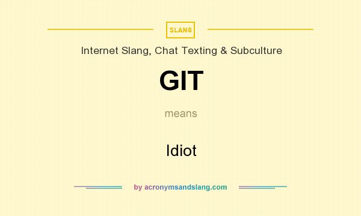
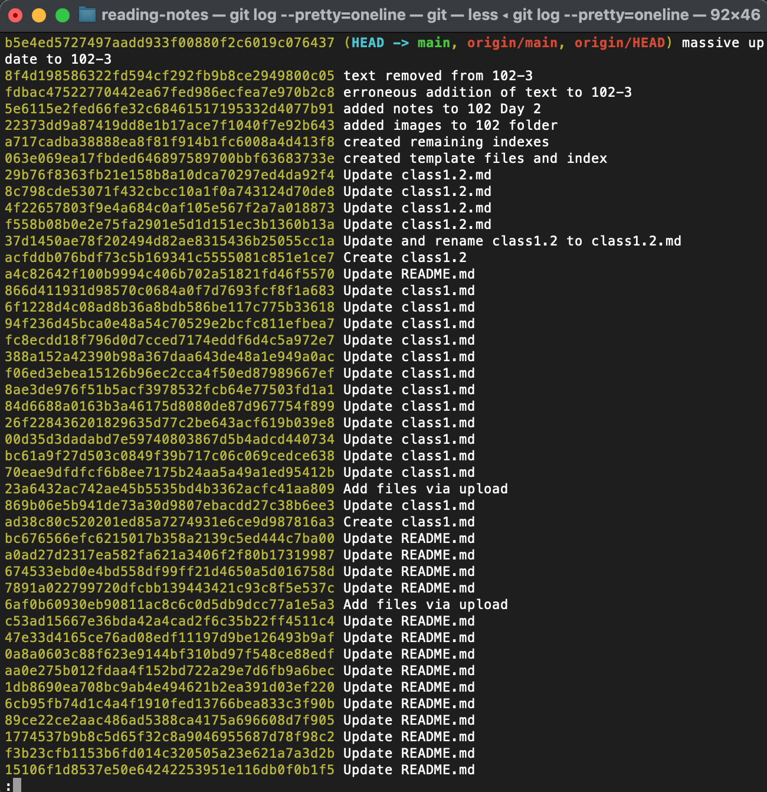

# Revisions and the Cloud

## Practice with git

### Cloning The Repository
- `git clone [link to repository]`

### ACP (Add, Commit, Push)

- `git status` shows what files have changed
- `git add .` stages new and modified files only
- `git commit -m ""them changes" by Thundercat"` commits the changes and creates a record of what was changed enclosed in the quotes
- `git push origin main` this pushes the changes from the local "main" branch to the remote repository named "origin"

git automatically gives the name "origin" to the server or cloud location and "master" to the local branch

### What is Version Control?
- A system that records changes to a file or set of files over time so that you can recall specific versions later.
- Can be local, centralized, or distributed

### What is `cloning` in git?
- This clones the source repository
or
- Creates a copy of an existing git repository from a particular server
- Copies all versions of all files for a project
- Copies newest version of the project

### What is the command to track and stage files?
- `git add .` or `git add filename`

### What is the command to take a snapshot of your changed files?
- `git commit -a` or `git commit -m "them changes"`

### What is the command to send your changed files to Github?
- `git push origin main`

## Stretch Goal - Clean Commitment (I have attachement issues)

