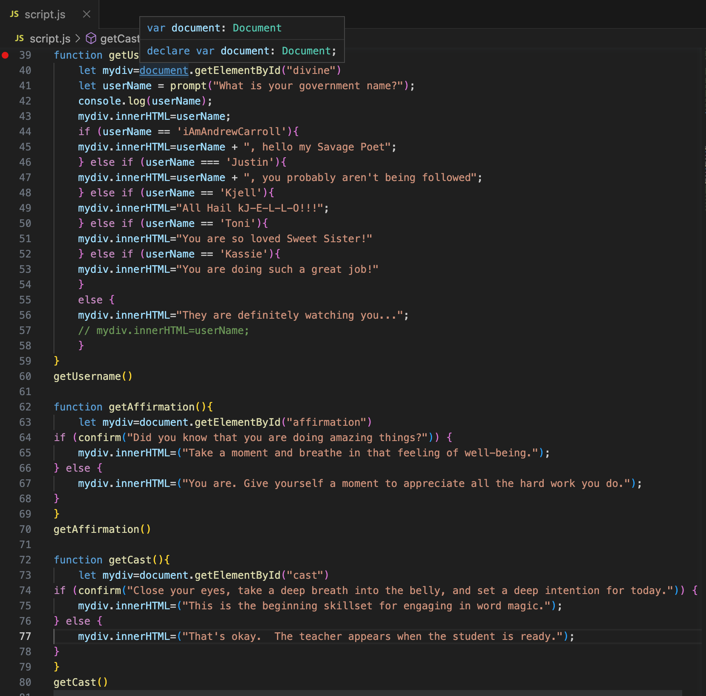

# Read: 07 - Programming with JavaScript

# MDN Control Flow

## The order in which the computer executes statements in a script: **Control Flow**

* Code runs in orer from the first line in the file to the last line
  * Unless there are structures that change the control flow
    * These could be **conditionals or loops**
* Example of `conditional` structure such as `if...else`
* 
  * `if...else` executes different code depending on the input provided
* Typical JavaScript includes many control structures
  * conditionals, loops, and functions
  * may also be set to execute when specific events occur
* **Control Structures** can dictate complex flows of processing even with only a few lines of code
* **Control Flow** means that when you read a script you must not only read from start to finish but also look at program structure and how it affects the order of execution

## JavaScript Functions (JS F)

* A JS F is a block of code designed to perform a particular task
* executed when "something" invokes (calls) it
* `function myFunction(p1, p2){return p1 * p2;}`

### JS F Syntax

* JS F is defined with the `function` keyword, followed by a **name**, followed by **()**
* F names can contain letters, digits, underscores, and dollar signs
same rules as variables

* **()** may include **parameter names** separated by commas
  * `(para1, para2, para3,...)
* The code to be executed by the function is placed within `{}`
* `function name(para1, para2, para3){**code to be executed**}`
* Function **arguments** are the *values* received by the function when invoked
* Inside the function, the arguments (the parameter) behave as local variables

## Function Invocation

* Code inside function executes when "something" **invokes** (calls) the function:
  * event occurs (user clicks a button)
  * invoked (called) from JS code
  * Auto (self invoked)

## Function Returns

* ex `let x = myFunction(4, 3)`
* ex `function myFunction(a, b) {return a * b;}` returns product of a*b as x

## Why Functions?

* Reuse code! define it once and use it many times
* `function toCel(fahrenheit) {return (5/9) * (fahrenheit-32);} document.getElementById("demo").innerHTML = toCel(77);`
* `toCel` refers to the function **object**
* `toCel()` refers to the function **result**
* accessing a funtino without () returns the function object instead of the function result

* Functions can be used the same way as variables, in all types of formulas, assignments, and calculations.
* ex using a variable to store the return value of a function
  * `let x = toCel(77); let text = "The temp is " + x + " Celsius";`
* ex use the function directly, as a variable value
  * `let text = "The temp is " + toCel(77) + " Celsius";`

* **Local Variables** are variables declared within a JS F
  * They become **LOCAL** to the function
  * Can only be accessed from within the function
* ex `function myFunction() {let carName = "Subaru"; code here CAN use carName}` while any code outside of that function can NOT use carName
* However, you can use the same name for variables outside of the function or in different functions
* can be created when the function starts, and deleted when the function is complete

# JS Operators (JS O)

* **Assignment Operator** 
  * `=` assigns a value to a variable
  * ex `let x = 10;` assigns a value of 10 to variable x
  * `+` adds numbers
  * `*` multiplication operator
* biary operator ex: `operand1 operator operand2`
* unary operator ex: `operator operand OR operand operator`

## Types of Operators
* Arithmetic *perform arithmetic*
* Assignment *assign values to JS variables*
* Comparison *greater than, less tahn, equal to, not equal to*
* String *comparison operators used on strings; strings are compared alphabetically*
* Logical *&& logical and; || logical or; ! logical not*
* Bitwise *work on 32 bit numbers; any numeric operand in the operation is converted into a 32 bit number. Result is converted back to a JS number*
* Ternary
* Type *returns variable type or returns true if an object is an instance of an object type; typeof or instanceof*