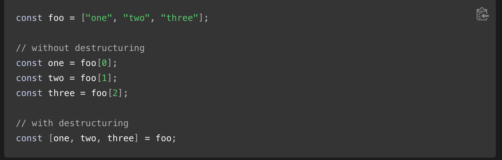
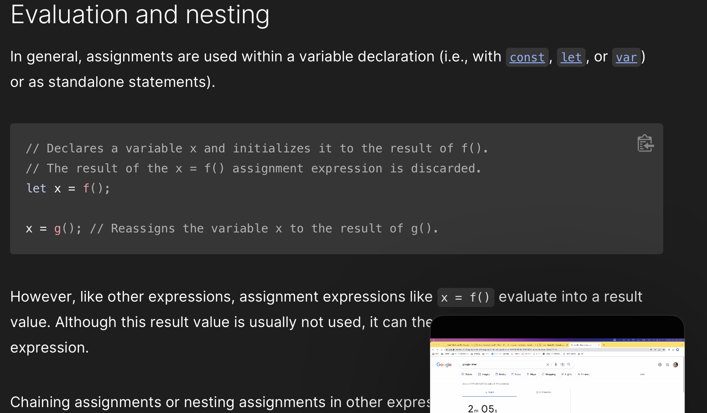
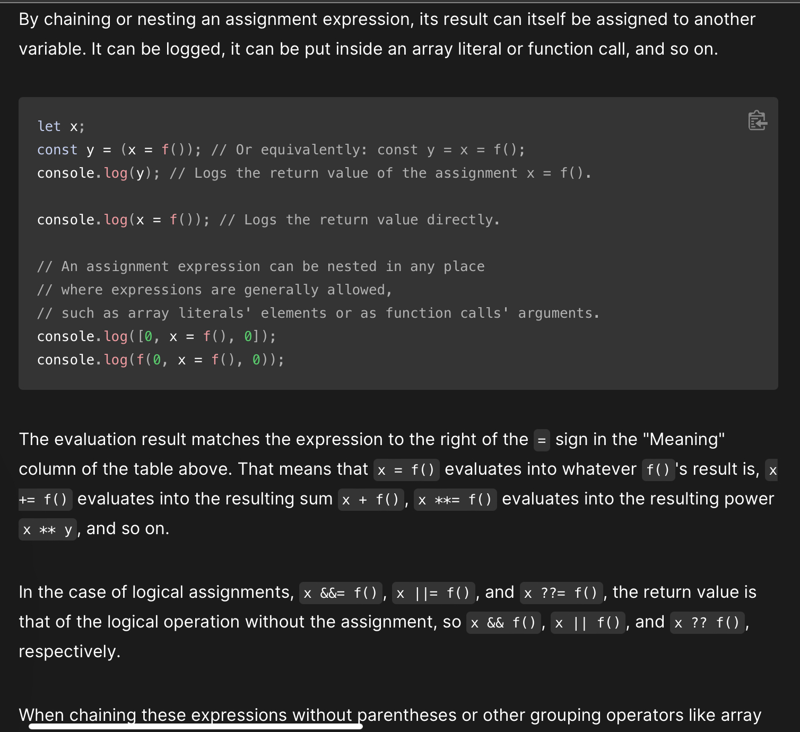
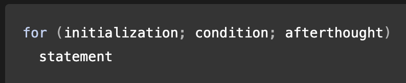
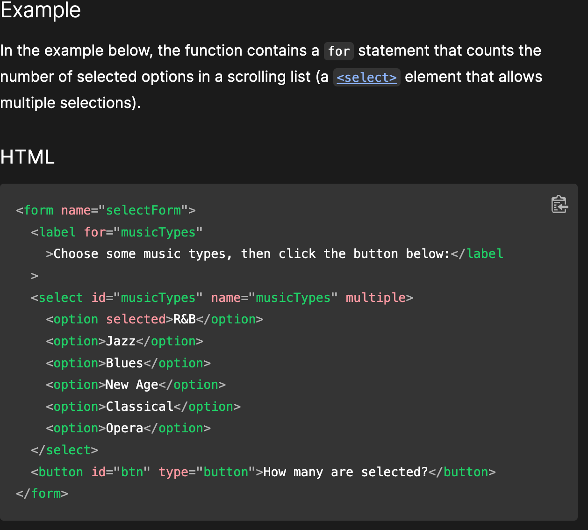
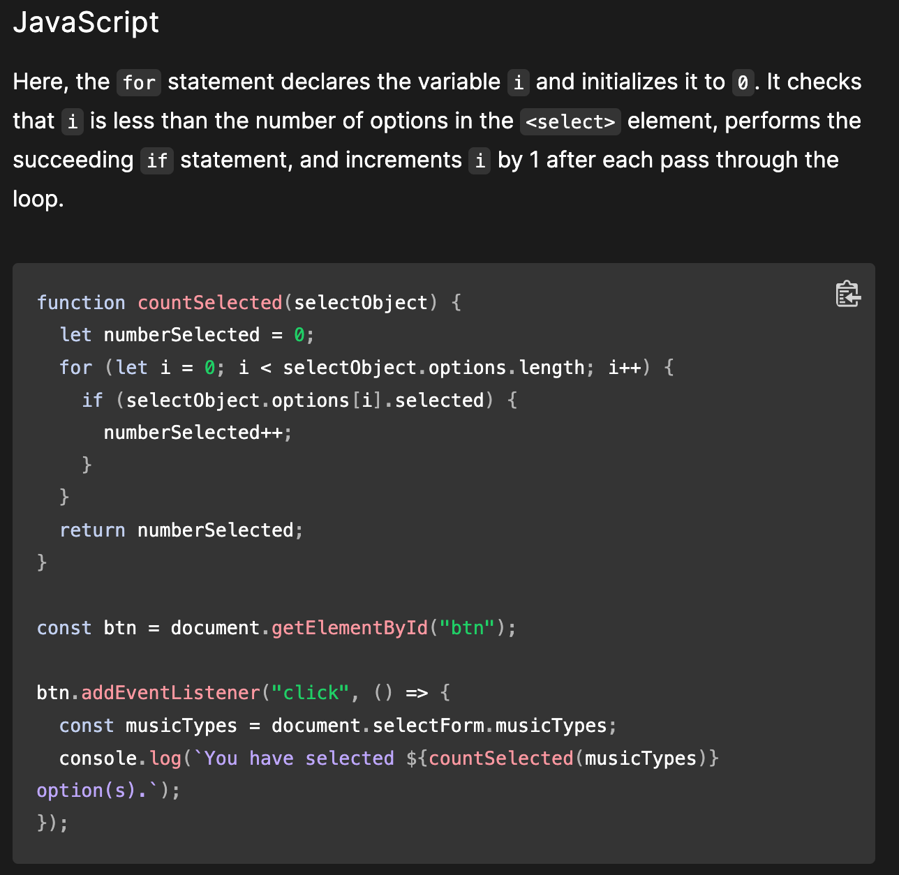

# Expressions of a 30 Something JS Function...Or Do Operators still answer the call?

## Two types of expressions:

### Side Effects - such as assigning values

* `x = 7`
* operator is `=` and assigns the value 7 to the variable x

### Purely Evaluate

* `3 + 4`
* uses the `+` operator to add 3 and 4 to produce the value 7
* however, this must become part of a bigger construct (variable declaration such as `const z = 3 + 4`) or its result will be immediately discarded

# JS Operators (JS O)

* **Assignment Operator** 
  * `=` assigns a value to a variable
  * ex `let x = 10;` assigns a value of 10 to variable x
  * `+` adds numbers
  * `*` multiplication operator
* biary operator ex: `operand1 operator operand2`
* unary operator ex: `operator operand OR operand operator`

## Types of Operators
* Arithmetic *perform arithmetic*
* Assignment *assign values to JS variables*
* Comparison *greater than, less tahn, equal to, not equal to*
* String *comparison operators used on strings; strings are compared alphabetically*
* Logical *&& logical and; || logical or; ! logical not*
* Bitwise *work on 32 bit numbers; any numeric operand in the operation is converted into a 32 bit number. Result is converted back to a JS number*
* Ternary
* Type *returns variable type or returns true if an object is an instance of an object type; typeof or instanceof*

### Assigning to Properties

* Does the expression evaluate an object? Then the left-hand side of an assignment expression may make assignments to properties of that expression
* EX: `const obj = {};` -> `obj.x = 3; console.lob(obj.x); // prints 3` or `console.log(obj); // prints x: 3.`
* EX: `const key = "y"; obj[key] = 5; console.log(obj[key]); // prints 5. console.log(obj); // prints { x: 3, y: 5 }`

* **Destructuring** is for more complex assignments and makes it possible to extract data from arrays or objects using a syntax that mirrors the construction of array and object literals (see below)

# For Statement

* `for` loop repeats until a specified condition evals to false.  JS loop is similar to Java and C loop
* `for` statements look as follows:

### When a `for` loop executes the folloing occurs

* initializing expression `initialization`, if any, is executed.  This ususally initializes one or more loop counters, but the syntax allows an expression of any degree of complexity.  Can also declare variables
* `condition` expression is evaluated. If the value of `condition` is true, the loop statement executes. Otherwise, `for` loop terminates. If `condition` expression is omitted entirely then condition is assumed to be true
* `statement` executes.  To execute multiple statements, use a block statement `({})` to group those statements
* If present, the update expression `afterthought` is executed
* control returns to step 2
* EXAMPLE

# While Statement

* a `while` statement executes its statements as long as a specified condition evaluates to `true`. A `while` statement looks like
* `while (condition) statement`
* if the `condition` becomes `false`, `statement` within the loop stops executing and control passes to the statement following the loop
* condition test occurs before `statement` in the loop is executed. If condition returns `true`, `statement` is executed and the `condition` is tested again. If the condition returns `false`, execution stop, and control is passed to the statement following while.
* to execute multiple statements, use a block statement ({}) to group those statements
1[whileloop](./pics/whilelp.png)

