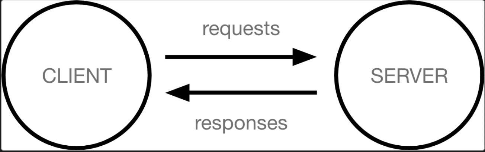
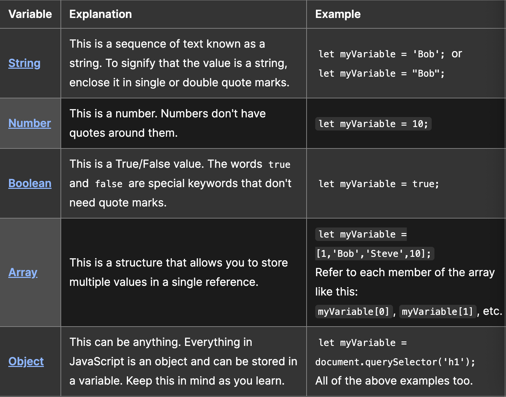
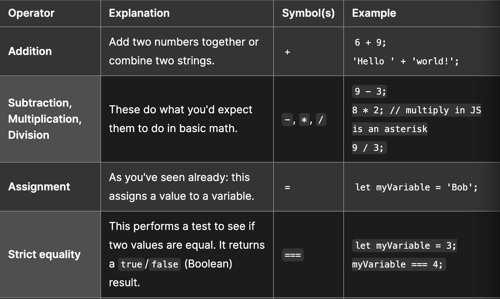
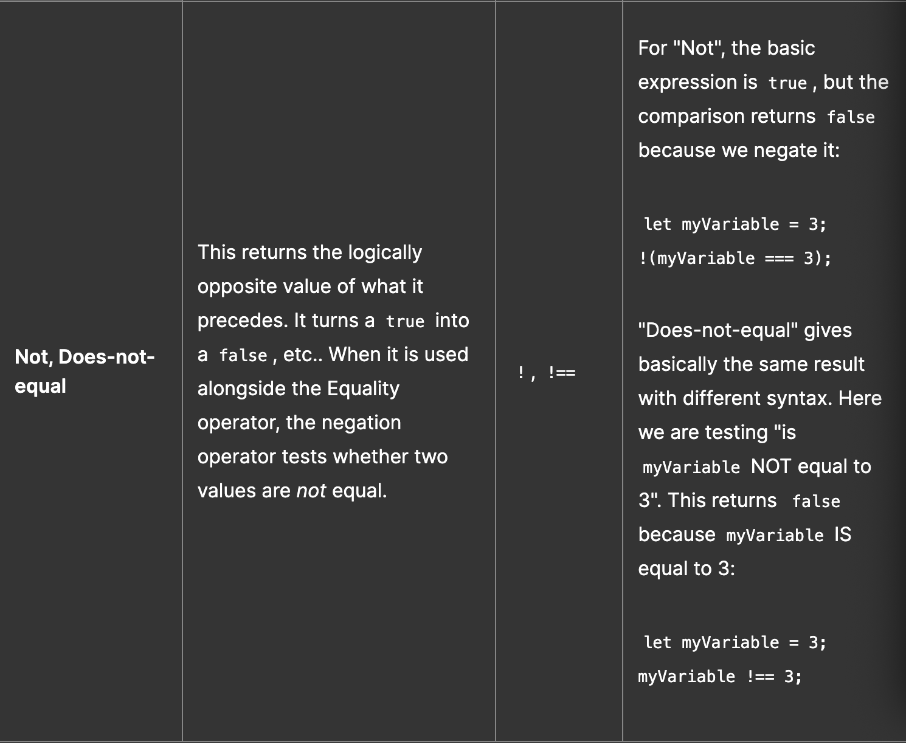
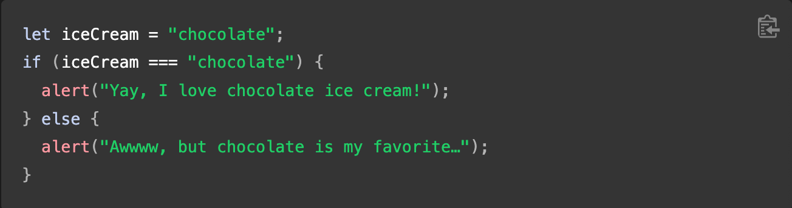
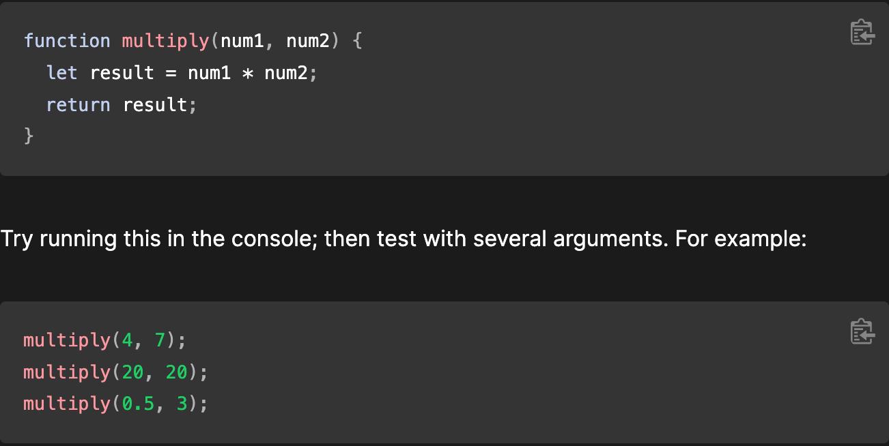
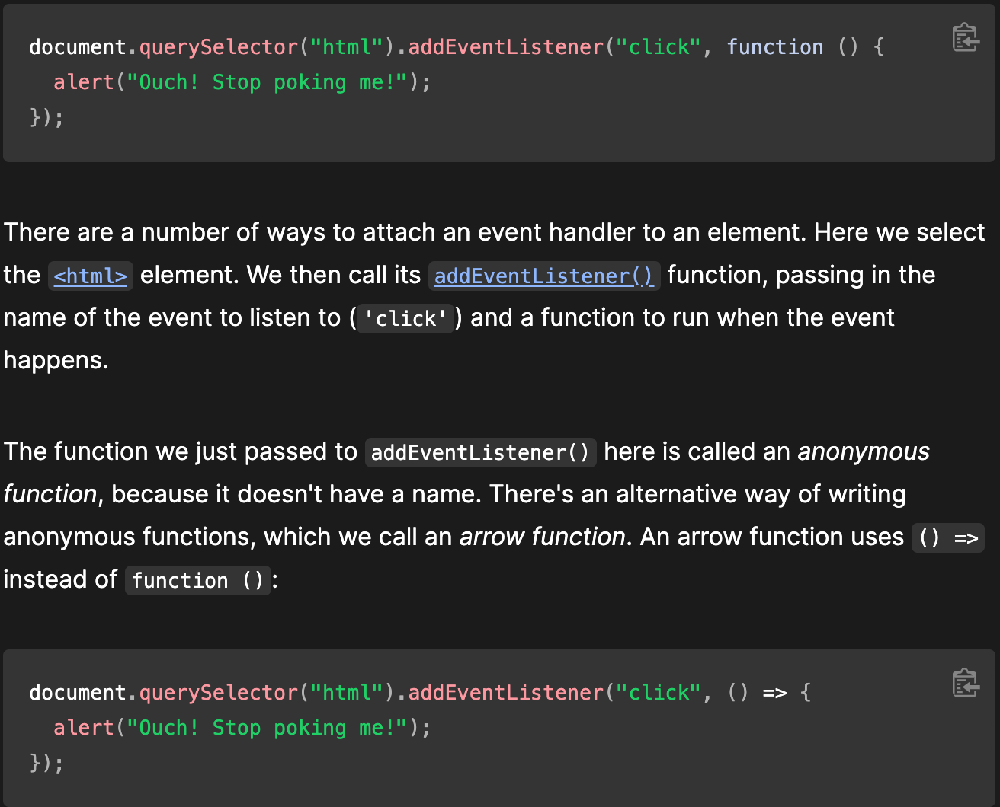
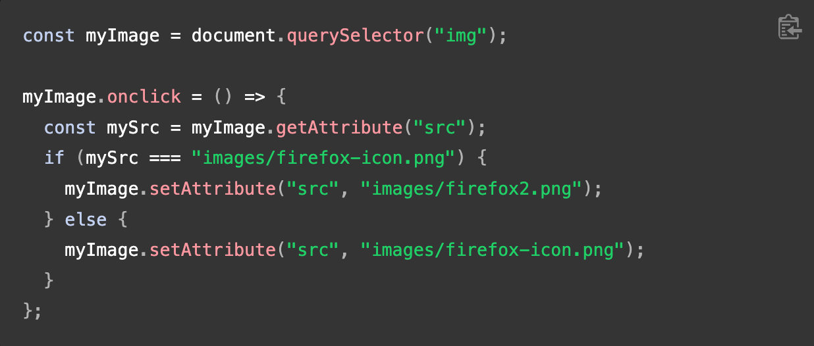
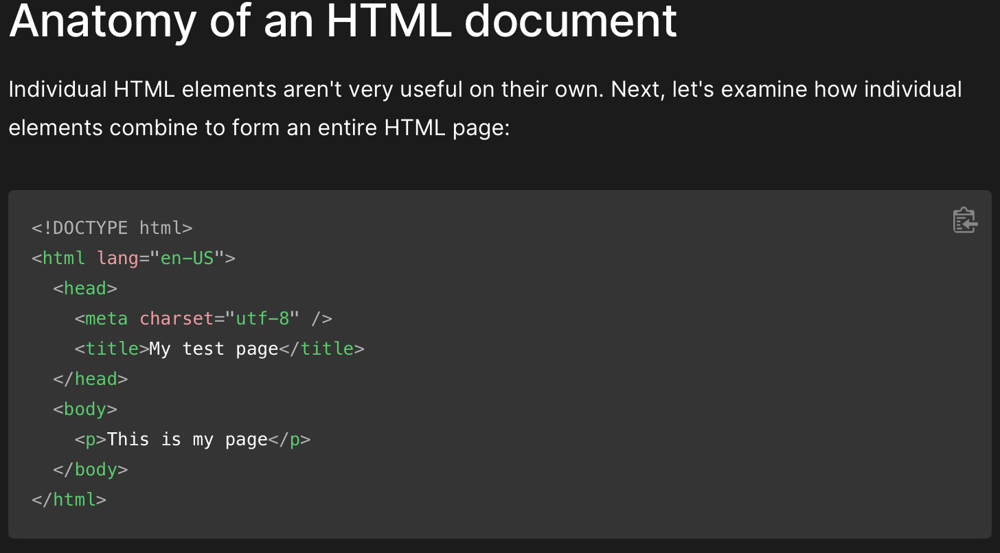

# Getting Started

## How The Web Works

### What happens when you view a webpage on your computer or phone?

  * Computers connected to the internet are called **clients** and **servers**
  * 
  * Clients are typical web user's internet-connected devices
  * Servers are computers that store webpages, sites, or apps.

### Other Parts of the Toolbox

* Internet Connection: Allows you to send and receive data on the web.  
* TCP/IP: Transmission Control Protocol and Internet Protocol are communication protocols that define how data should travel across the internet.  The transport mechanism.
* DNS: Domain Name System is like an address pook for websites.  Type in a web address and your browser, the browser looks at the DNS to find the website's IP address before it can retrieve the website.
* HTTP: Hypertext Transfer Protocol is an application protocol that defines a language for clients and servers to speak to each other.
* Component Files: Website is made up of many files.
  * Code Files: Websites are built primarily from HTML, CSS, and JavaScript
  * Assets: This is a collective name for all the other stuff that makes up a website such as images, music, video, Word Documents, and PDFs

### So What Happens, Exactly?

1. Browser goes to DNS server, finds real address of the server the website lives on.
2. Browser sends an HTTP request message to the server, asking it to send a copy of the website to the client. All messages are sent across your internet connection using TCP/IP.
3. If the server approves the clients request, the server sends the client a "200 OK" message, which means "Of course you can look at that website! Here it is!" and sends the files to the browser as a series of small chunks called data packets.
4. Browser assembles the small chunks into a complete web page and displays it to you.

### The Poetic Art of Packet Shipment

So you logged into the portal and your just a silly mortal and your asking for advice from techno god...So you place shaking hands on the alter and manipulate the glyphs and your inputs are discretely placed upon the screen...Now your searchbox has been filled and your feeling kind of thrilled because today is going to be the day that you receive the gifts...and with that one little finger you press slowly on the lever and send your prayers along the fiber wire lightwave coursing straigh away...Techno god has allowed messengers and ghosts to parse the holy tomes and they have already anticipated your request...the algorythm anticipated your every stroke; familiar spirits, behold these ghosts...Hypertextually Transfered responses behave in accordance with the Protocols of destiny and the language of the Techno god is proven true...see these are little packets on a million different journey's that lead them right back to the brower where your fingers laid the framework to receive...So in this response you are just like Ponce, an explorer blazing trail to this day...In a predefined language the techno god served you the wisdom you requested as you sacrificed your data on the alter of the algorythm...the portal has opened...the portal is open...come on through

### Order in Which Component Files Are Parsed

* Browser sends requests to servers for HTML files which often contain `<link>` elements referencing external **CSS** stylesheets and ``
  3. does the same job as the `<link>` element CSS.  Applies JS to the page so it can have an effect on the HTML, CSS and anything else on the page.
  4. Add this code to the `main.js` file:
     * `const myHeading = document.querySelector("h1"); myHeading.textContent = "Hello World!";`
  5. make sure the HTML and JS files are saved.  Load `index.html` in your browser

### What Happened?

* You changed the headding text using a function called `querySelector()` to grab a refernce to your heading, and then stored it in a variable called `myHeading`.  Similar to CSS Selectors...when you want to do something to an element, you need to select it first.
* Following the function the code set the value of the `myHeading` variable's `textContent` property which represents the content of the heading to Hello World!

## Language Basics Crash Course

### Variables and other Stuff

* Some of the Core Features of the JS language...these are common to all programming languages...so master these fundamentals

* `variables` are containers that store values.
  * start by declaring a variable with the `let` keyword, followed by the name you give the variable
    * `let myVariable;`
    * a semicolon at the end of a line indicates where a statement ends.  Only required when you need to seperate statements on a single line
    * [here is a guide to semicolon use in JS](https://www.codecademy.com/resources/blog/your-guide-to-semicolons-in-javascript/)
    * JS is case sensitive...this means `myVariable` is not the same as `myvariable`.
* Assign a value to the variable
  * `myVariable = "Bob";`
  * these steps can be done at the same time as follows `let myVariable = "Bob";`
* Retrieve the variable by calling the variable name `myVariable;`
* You can change the assigned value late in your code as follows
  * `let myVariable = "Bob"; myVariable = "Steve";`
* 
* Variables are necessary to do anything interesting in programming.  If values couldn't change, then you couldn't do anything dynamic, like personalize a greeting message or change an image displayed in an image gallery.

### Comments

* Snippets of text taht can be added along with code.  Browsers ignor text marked as comments.  Comments in JS are done just like in CSS
  * `/*line breaks and comments*/` or `// this is the comment`

  ### Operators

  * an `operator` is a mathematical symbol that produces results based on two values or variables.  Some simple operators and examples...
  
  

### Conditionals

* Code structures used to test if an expression returns to true or not
* `if...else` is a very common conditional

* expression inside the `if()` is the test. 
* uses strict equality operator to compare the variable `iceCream` with the string `chocolate` to see if the two are equal
* if returns `true`, the first block of code runs. 
* if returns `not true`, second block of code, after the `else` statement, runs instead

### Functions

* package functionality we wish to reuse 
* better than having to rewrite the same code repeatedly
* `let myVariable = document.querySelector("h1");`
* `alert("hello!");`
  * these functions are built into the browser.
* if you see something that looks like a variable name but it's followed by parentheses `()` it is likely a function
* Functions often take **arguments**: bits of data they need to do their job.  Arguments go inside the parentheses separated by commas if there is more than one argument
* `alert` function makes a pop-up box appear inside the browser window and requires a string as an argument to tell the function what message to display
* You can also define your own functions

### Events

* Real interacticity requires event handlers
* These are code structures that listen for activity in the browser, and run code response.
* most obvious is handling the `click event` which is fired by the browser when you click on something with your mouse

### Adding an Image Changer

* Use JS and DOM API features to alternate the display of one of two images
* Change happen as a user clicks the displayed image
1. Choose an image you want to feature
2. Save this image in the img folder
3. Rename the image as whatever you want
4. Add the following JS code to your `main.js` file:

### How can you find images for your Website?

* Use some from your own photos
* Use an open source image database

### How do you create a `string` vs a `number` in JavaScript?

* A string is enclosed in single or double quotes
  * `"this is a string"`
  * it is important to remember that you need to use double or single quotes in the proper format
* A number is not enclosed in quotes
  * `45, 68, 74, 98`

# Getting Started With HTML

* What is an HTML attribute?
  * Attributes contain extra information about the element that won't appear in the content.
  * `
this is the content
` where `class="editor-note"` is the attribute.
* Describe the anatomy of an HTML element.
  * `Opening & Closing tags` that wrap `content` to create and `element`
* What is the difference between `<article>` and `<section>` element tags?
* What elements does a **typical** website include?
  * 
* How does metadata influence Search Engine Optimization?
* How is the `<meta>` HTML tag used when specifying metadata?

## Miscellaneous

* How to start to design a website?
  1. What is the first step to designing a website?
     * Creating the basic HTML document framework from which you will build out your `index.js` and `css` frames and all of your content.
  2. What is the most important question to answer when designing a website?
     * What is your website about?  What do I want to accomplish?  Without knowing this you aren't going to be able to create anything coherent.

* Semantics
  1. Why should you use an `<h1>` element over a `` element to display a top level heading?
     * `<h1>` is a semantic element which gives the text it wraps the role (or meaning) of **a top level heading on your page**.  This is important for SEO and other rankings within the landscape.
  2. What are the benefits of using semantic tags in our HTML?
     * Search engines will consider its contents as important keywords to influence the page's SE rankings
     * Screen readers can use it as a signpost to help visually impaired users
     * Finding blocks of meaningful code is significantly easier than searching through endless `divs` with or without semantic or namespaced classes
     * Suggests to the developer the type of data that will be populated
     * Semantic naming mirrors proper custom element/component naming

* What is JavaScript?
  1. Describe 2 things that require JavaScript in the browser.
     * Dynamically updated content, mulitmedia controls, animated images
  2. How can you add JS to an HTML document?
     * Internal JS - just before the closing `</head>` tag
     * External JS - create a `script.js` file and code away
     * Inline JS - JS that lives inside the HTML

