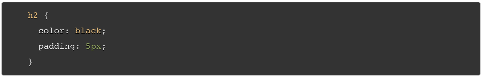

# Introduction to HTML, CSS, & JavaScript

### HTML

1. Why is it so important to use semantic elements in our HTML:
   * Search engines will consider its contents as important keywords to influence the page's SE rankings
   * Screen readers can use it as a signpost to help visually impaired users
   * Finding blocks of meaningful code is significantly easier than searching through endless `divs` with or without semantic or namespaced classes
   * Suggests to the developer the type of data that will be populated
   * Semantic naming mirrors proper custom element/component naming
2. How many levels of headings are there in HTML?
   * HTML has 6 different heading levels
3. What are some of the uses for the `` and `` elements?
   * `` is the superscript elements and can be used to annotate things like `th` on the number 25th
   * `` is the subscript element and can be used to annotate things like chemical formulas by adding subscript like this
4. When using the `<abbr>` element, what attribute must be added to provide the full expansion of the term?
   * `<abbr title="Reverend">Rev.</abbr>
   * The title element provides the full expansion of the term.

### CSS

1. What are ways we can apply CSS to our HTML?
   * External stylesheet - seperate file with `.css` extension
     * `<link rel="stylesheet" href="styles.css" />`
   * Interal stylesheet - resides inside the HTML document
     * styles get placed inside a `<style>` element containd in side ehe HTML `<head>`
   * Inline styles - declarations that affect a single HTML element
     * `
This is my first CSS example

2. Why should we avoid using inlines styles?
   * It is the opposite of a best practice.  It is the least efficient implementation of CSS for maintenance.  One change may require multiple edits within a single web page.  Inline CSS also mixes CSS presentational code wtih HTML and content, making it more difficult to read and understand.  Separating code and content makes it easier to maintain for all who work on it!
3. Review the block of code below and answer the following questions:

   1. What is representing the selector?
      * `h2` is the selector.
   2. Which components are the CSS declarations?
      * color & padding are the declarations.
   3. Which components are considered properties?
      * black and 5px are the properties.

### JavaScript

1. What data type is a sequence of text enclosed in single quote marks?
   * a string
2. Name 4 types of JS Operators:
   * Addition `+`
   * Subtration, multiplicaiton, and division `-, *, /`
   * Assignment `=`
   * Strict equlity `===`
3. Describe a real world problem you could solve with a function.
   * deciding whether or not it was time to get out of bed.  

1. An if statement checks a `condition` and if it evaluates to `true` then the code block will execute.
2. What is the use of an `else if`?
   * An else if is used if we have more than two choices/outcomes and need to evaluate more than just true/false.
3. List 3 different types of comparison operators.
   * `===` & `!==` identical or not identical
   * `< & >` greater than or less than
   * `<= & .>=` greater/less than or equal to
4. What is the difference between the logical operator `&&` and `||`?
   * `&&` AND; chains together two or more expressions so that all of them have to individually evaluate to `true` for the whole expression to return `true`
   * `||` OR; allows you to chain expressions so that one or more of them have to individually evaluate to `true` for the whole expression to return `true`

