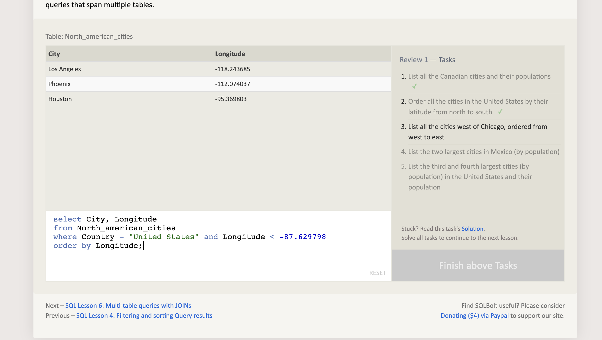

# Reading

1. Pain And Suffering
   * The main challenge facing beginners learning Python is the rigorous environment created by an accelerated learning program.  Discomfort, lack of understanding, poor sleep, sedentary work environment, difficult tasks, minimal information.  All of these pain points force growth in the student.  
   * Strategy 1 for overcoming the challenges:  I choos joy and my overall experience.  Each challenge is an opportunity for personal growth and development.  I have agency and in this agency I have chosen to face this obstacle in order to create the life of freedom that I demand for myself.  I willingly pay this price today for a future of freedom.
   * Strategy 2:  I will continue to work on my creative projects (podcasts, poetry, improv performance, writing, etc) as I work through this class.  I will also continue to workout and eat in alignment with my purpose and mission in life.

2. Beginners Guide to Big O
   * Time Complexity:  measures how long an algorithm takes to run as a function of the size of its input. O(n) time is "linear" because runtime is proporotional to size of input. 
     * Constant: O(1)
     * Linear O(n)
     * Quadratic O(n^2)
     * Log O(log n)
     * Exponential O(2^n) 
   * Space Complexity:  measures memory use as a function of the size of input.  O(n) is said to be linear space due to the proportionality of memory to input use.

3. "Names & Values in Python": Differences between mutable and immutable data types in Python.
   * Immutable: cannot be changed after they are created.
     * sometimes you will create a new object and assigning it to the variable.  
     * types: numbers, strings, tuples 
       * tuples are ordered, immutable collections of elementsenclosed in parentheses (). similar to lists but they cannot be modified after creation.

   * Mutable: can be changed after creation.  
     * state can be changed without creating a new object
     * types: lists, dictionaries, sets

# Prep: Growth Mindset

* I genuinely work very hard to understand and address personal and organizational bias.  Understanding that I engage with automatic bias allows me to slow down and be present and mindful of my heart and the desires of my spirit.  Equity > Equality.  See the human BEING in everything.

* Not really any new insights or surprises.  I do a lot of interpersonal work and shadow-hunting.  I keep myself as grounded as possible and continually work to live in a state of effortless truth.
   * Self-Awareness: 4,4,4,5,4 = 21
   * Self-Management: 4,4,4,5,4 = 21
   * Social Awareness: 4,4,4,4,4 = 20
   * Relationship Management: 4,4,4,4,4 = 20

* Deliberate practice, practice, practice makes imperfect familiarity which leads to greater efficiency over time.

* Grit is the ability to keep going in support of your goals when the friction of the journey is high

* Growth mindset is a must.  Be open, adaptable, and in flow even as you are ruthlessly committed to your purpose and vision.  People think that being open minded is a lack of conviction but I see it differently.  I believe that open mindedness allows me to be even more convicted in my personal journey.  Experience everything.

* Success ... love and support of self and others.  Like mom...except we don't have a mom...or everyone isn't mom...or something.

## SQL Practice got stuck here even though it is returning the proper result

## The Command Line

* Linux treats everything like a file, is case sensitive, and allows spaces in file names.
  * There are escape characters for accessing directories with spaces in their names: cd Holiday\ Photos
  * linux will hide files with a file name beginning with . ...
  * linux is an extensionless system

* man <command>
  * Look up the manual page for a particular command.
* man -k <search term>
  * Do a keyword search for all manual pages containing the given search term.
* /<term>
  * Within a manual page, perform a search for 'term'
* n
  * After performing a search within a manual page, select the next found item.

* mkdir
  * Make directory
* rmdir
  * remove directory
* touch
  * create a blank file
* cp
  * copy
* mv
  * move
* rm
  * remove

* linux does not have an undo command so be cautious
* command line options can be found in the man page for further information

### [Cheat Sheet](https://ryanstutorials.net/linuxtutorial/cheatsheet.php)

# Data Structures & Algorithms

1. What is 1 of the more important things you should consider when deciding which data structure is best suited to solve a particular problem?
   * understanding what data type best solves a particular problem.  what type of operations will be performed on the data?  certain data structures are perfectly suited to for different operations.

2. How can we ensure that we’ll avoid an infinite recursive call stack?
   * having a base case that tells the function to stop
   * avoid recursion when a loop will work

# Engineering Readings

1. Because we are all unique does that mean none of us are special?  Of course not!  My life experience has created in me a unique view and style that no one else on the planet before or after can duplicate.  I'm committed to truth and trust.  To authentic expression of self.  To creating a space for other people to be their absolute best and step courageously into the world.  I play to my edges and help others do the same.

2. Three things
   * Step away, take a break, move my body
   * Create something every single day that isn't code related
     * poetry, freestyle, art, sing, dance when I'm stuck
   * Take a moment to breathe and remind myself why I'm doing this work.